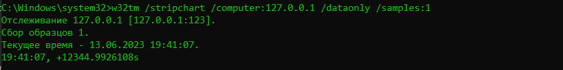

SNTP-сервер
===========

Автор: Меньшиков Александр Сергеевич  
Группа: КН-202

Описание
--------

SNTP-сервер - это простая реализация сервера времени, основанная на 
протоколе Simple Network Time Protocol (SNTP). Сервер может предоставлять 
точное время клиентам, а также может добавлять заданное смещение к текущему времени, чтобы 
"врать" на указанное значение.

Принцип работы
--------------

SNTP-сервер работает на основе протокола Simple Network Time Protocol (SNTP), 
который использует User Datagram Protocol (UDP) для обмена данными между клиентами и 
сервером.

Когда клиент отправляет запрос на сервер, содержащий запрос времени, сервер принимает 
этот запрос и обрабатывает его. Для получения текущего времени сервер обращается к 
системному времени устройства, на котором он запущен.

После получения текущего времени сервер формирует ответ, 
который содержит текущее время с добавленным смещением и другую необходимую информацию, такую как уровень сервера, 
индикатор прыжка, номер версии протокола SNTP и др.

Настройка
---------

Настройки SNTP-сервера задаются в файле `config.json`:

```json
{   
  "server_ip": "127.0.0.1",   
  "server_port": 123,   
  "offset": 12345,   
  "stratum": 1,   
  "leap_indicator": 0,   
  "version_number": 4
}
```
*   `server_ip`: IP-адрес, на котором будет слушать сервер.
*   `server_port`: Порт, на котором будет слушать сервер. Установите значение `123`, чтобы использовать стандартный порт SNTP.
*   `offset`: Смещение времени в секундах, которое будет добавлено к текущему времени. Используется для создания эффекта "врать" серверу.
*   `stratum`: Уровень сервера. Задайте значение `1`, чтобы указать, что сервер имеет самый высокий уровень.
*   `leap_indicator`: Индикатор прыжка. Задайте значение `0`, чтобы указать, что нет прыжка во времени.
*   `version_number`: Номер версии SNTP-протокола, которым оперирует сервер.

Пример запуска
--------------

Чтобы запустить SNTP-сервер, выполните следующую команду в командной строке:

```shell
py main.py
```

Пример работы
-------------

Зададим в `config.json` значение `offset`, равное `12345`, и запустим сервер.

Ниже представлен пример работы сервера с использованием утилиты `w32tm` и скриншот результата:



В данном случае была выполнена команда `w32tm /stripchart`, которая используется для 
отслеживания времени с удаленного сервера. Заданный параметр `/computer:127.0.0.1` 
указывает на то, что мы хотим отслеживать время с локального компьютера по его IP-адресу 
`127.0.0.1`. Далее, с помощью опции `/dataonly` мы просим вывести только данные времени без 
дополнительной информации. Параметр `/samples:1` указывает, что мы хотим получить только 
один образец времени.

Результат выполнения команды сообщает нам текущее время: `13.06.2023 19:41:07`. 
Также указано смещение времени относительно эпохи Unix, которое равно `+12344.9926108` 
секунд. Это означает, что текущее время отстает на `12344.9926108` секунд от начала 
эпохи Unix (1 января 1970 года), т.е. сервер соврал на указанное нами количество секунд.